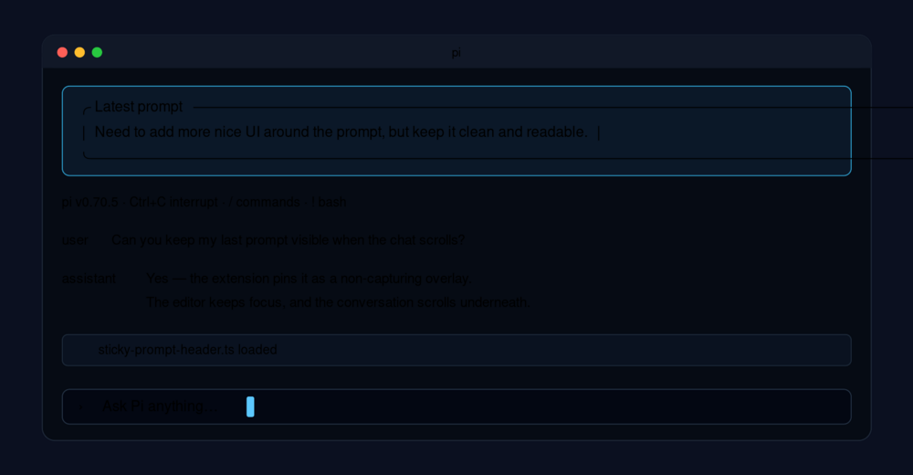

# Sticky Prompt Header for Pi

A tiny [Pi](https://github.com/badlogic/pi-mono/) extension that keeps your latest submitted prompt visible while you work.



## What it does

- Shows the latest user prompt in a compact Pi-styled banner.
- Defaults to ANSI paint mode: a top-of-viewport banner appended to Pi's own terminal writes.
- Keeps focus in Pi's normal editor and terminal UI.
- Avoids Pi overlay compositing by default; widget/title/overlay fallback modes are available.
- Provides a toggle command plus a manual repaint command for awkward terminal redraws.

## Install

Copy the extension into Pi's global extensions directory:

```bash
mkdir -p ~/.pi/agent/extensions
cp sticky-prompt-header.ts ~/.pi/agent/extensions/
```

Then restart Pi or run:

```text
/reload
```

## Usage

Submit a prompt in Pi. By default, the latest prompt is painted at the top of the terminal using an ANSI drawing hook appended to Pi's own terminal writes. This avoids Pi overlay compositing and background repaint timers.

Commands:

```text
/sticky-prompt-header              # toggle on/off
/sticky-prompt-header repaint      # force a redraw
/sticky-prompt-header images       # toggle extra redraws after image tool output
```

Switch display modes:

```text
/sticky-prompt-header mode ansi     # default, top-of-terminal ANSI paint
/sticky-prompt-header mode widget   # stable widget above editor
/sticky-prompt-header mode title    # titlebar only
/sticky-prompt-header mode overlay  # experimental Pi overlay
```

## Notes

The original overlay-only version could disturb terminal scrollback when Pi or the footer/status area repainted. ANSI mode takes a different path: it piggybacks on Pi's own terminal writes and paints the banner last, without scheduling background redraws. Widget/title modes are safer fallbacks; overlay mode remains available for terminals where Pi overlays behave well.
